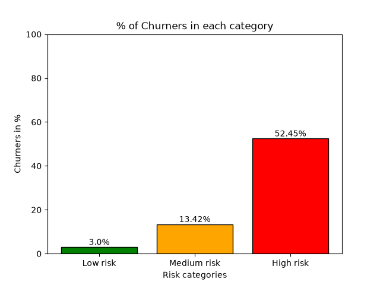
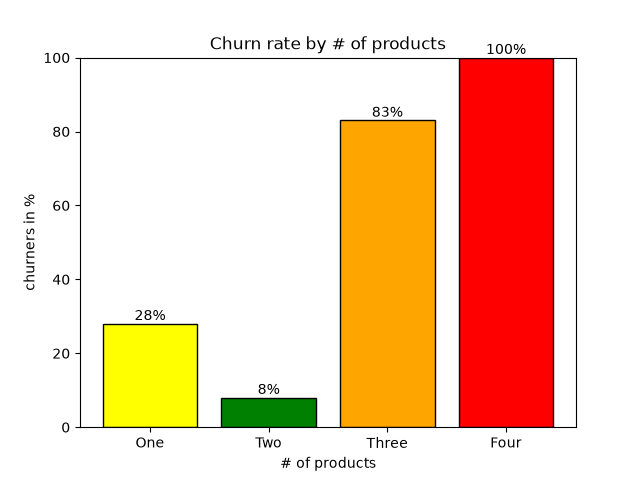
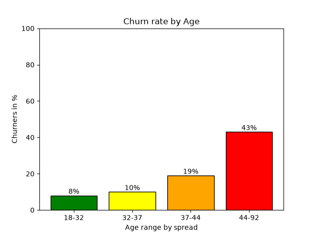
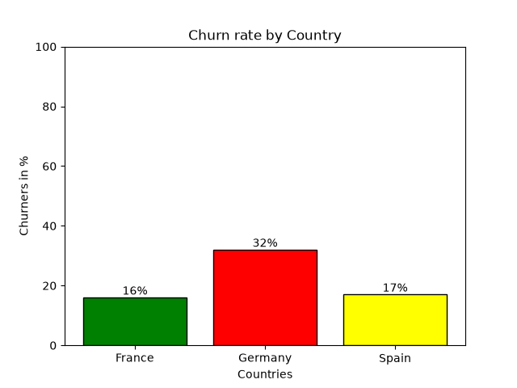

# Churn risk scorer

## Project Overview
Dataset is 10,000 rows with 20% churn rate at a bank. This project is a model that scores the likeliness of churning of each customer account based on the features/columns provided by the dataset. Each column has a specific weight associated with it. That weight is calculated by how good of a churning predictor that column is. The weights were calculated in the EDA.py file and explains each columns weight and findings in detail. The scores calculated from the model are out of 100%. The scores were split into 3 categories:
- Low risk = 0-25% percentile(x <= 12.65%),
- Medium risk = 25%-75% percentile(12.65% <= x <= 23.79%),
- High risk = 75%-100% percentile(23.79% <= x)
**This version of the dataset is found in Data/cleaned folder(the churn score and the three categories)**

## Motivation
Churning at banks and really any company significantly damages a company's profit. It is 5-7x more expensive to acquire customers than retaining one. This is a huge incentive to maintain customers. This project is also useful in seeing what makes customers churn. You can see the reasons from which customer features cause churning and make business adjustments to that and improve your company to retain more customers and in turn increase profit.

## Methodology
- I first split each columns data according to the quartile ranges and found the percentage churn rate of each percentile. If it was a categorical column, I found the churn rate of each category for that column.
- I then found the gap between the likeliest churning category then the lowest.
    - ex. using just one column,
    - column name = gender
    - Male: 16% churn rate
    - Female: 25% churn rate
    - gap: (25 - 16)/100 = 0.09
- Then, I added all the columns gaps.
    - in this project, the sum = 1.75
- then to find the weight of the each column:
    - **weight of gender column: 0.09/1.75 = 0.0514**
- I then multiply the weight of the columns with the category of that column's churn rate. I did this for all the columns
    - for Male: 0.16(churn rate) * the weight(0.0514)
    - for female: 0.25(churn rate) * the weight(0.0514)
- Since a customer contains every column I added all the scores of that customer's features and calculated a churn score for each customer.
- Then those scores are split into 3 categories like I mentioned in the overview.

## Results
When I tested my categories I found:
- 52.45% of high risk category were churners.
- 13.42% of medium risk category were churners.
- 3.0% of low risk category were churners.
     

My model's mean churn score matched the actual 20% churn rate, showing that it was well calibrated.
**My results show that my model is able to predict 2.6x higher than the average churn rate of 20%**

I also found the Top 3 churn indicating columns for my dataset(these graphs are found in the visualizations folder and the source code is in src):

## Technical skills used:
- Python: programming language used
- Pandas: For EDA and data cleaning
- numpy: For array used to visualize
- matplotlib: For bar charts
- pathlib: for file managment

## How to Run
- install python libraries: "pip install pandas numpy matplotlib"
- import pathlib it's already in python, no need for downloading.
- Run EDA.py first, then Churn_analysis.py, lastly visuals_scr.py
- File paths are okay, just run it as they are.

## Future improvements
- Future improvements would be to use machine learning models such as linear/logistic or random forest.

  

